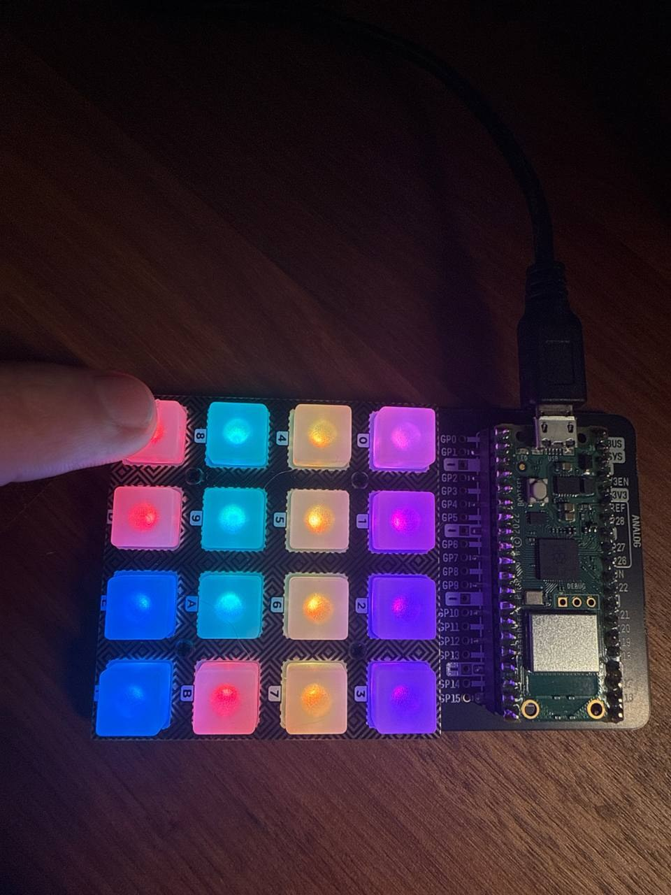
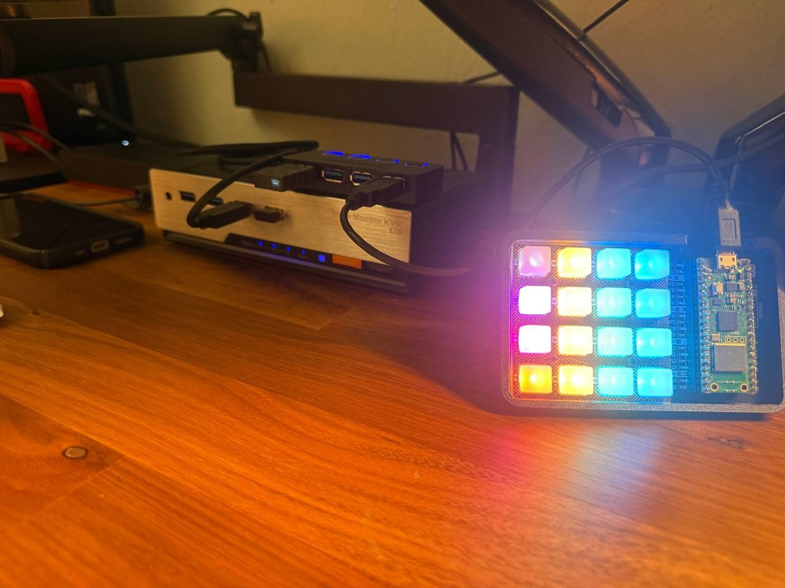
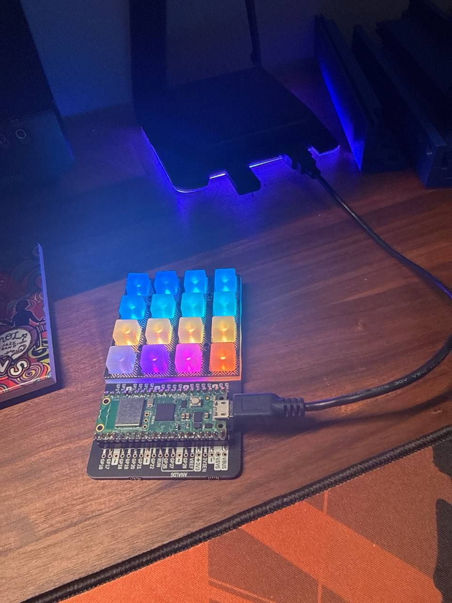

# Pico RGB Command Deck

**Release: v1.0.0 — 2026-10-04**

Known-good 4×4 RGB command deck for the TESmart DKS203-M24, built with a Raspberry Pi Pico W and Pimoroni Pico RGB Keypad Base (`PIM551`).

## Photos

### Final horizontal layout



### Connected to the TESmart through the shared HID hub



### Early illuminated hardware test



## Verified working topology

Verified during normal use on 2026-10-04:

```text
TESmart dedicated keyboard/HID port
        ↓
USB hub
   ├── Raspberry Pi Pico W RGB Command Deck
   └── 8BitDo 2.4 GHz wireless receiver
          ⇅
       8BitDo keyboard
```

This configuration currently supports all of the following simultaneously:

- Normal typing through the 8BitDo wireless keyboard
- Manual TESmart hotkeys from the 8BitDo keyboard
- Programmed TESmart commands from the Pico
- Automatic 8BitDo reconnection after powering the keyboard off and back on

The hub must connect to the TESmart **dedicated keyboard/HID port**. A standard shared USB peripheral port passes normal input but bypasses the CH545 hotkey detector.

An earlier connection attempt entered a bad USB enumeration/polling state: a Pico key stayed white while its HID send stalled. Reconnecting the hub/devices restored operation. The current arrangement is working well, but a full TESmart power-cycle and longer soak test are still useful before treating every reconnection order as proven.

## Hardware

- Raspberry Pi Pico W
  - CircuitPython `10.3.0`
  - Board ID `raspberry_pi_pico_w`
- Pimoroni Pico RGB Keypad Base (`PIM551`)
- 16-key silicone keypad and retainer
- Micro-USB data cable
- USB hub connected to the TESmart dedicated keyboard/HID port
- Planned normally-open reset button and printed enclosure

Hardware identifiers are intentionally omitted.

## Production USB requirement

The TESmart CH545 did not reliably accept the normal composite CircuitPython USB presentation. Production `boot.py` therefore exposes exactly one boot-protocol keyboard and disables unnecessary USB interfaces:

```python
storage.disable_usb_drive()
usb_cdc.disable()
usb_midi.disable()
usb_hid.enable((usb_hid.Device.KEYBOARD,), boot_device=1)
```

Do not add storage, serial, mouse, consumer-control, MIDI, or other composite interfaces to normal production mode without retesting the TESmart connection.

## Recovery and reset

The source tree matches the known-good production behavior and uses the proven GP14 recovery path.

### Development-mode recovery

Before powering or resetting the Pico, connect:

```text
GP14 physical pin 19 → GND physical pin 18
```

This keeps the normal `CIRCUITPY` drive and USB serial interfaces available for editing. Remove the jumper before returning to production mode.

`BOOTSEL` remains the final UF2 recovery method.

### Planned hardware reset button

```text
RUN → normally-open momentary button → GND
```

Never connect `RUN`, `GP14`, or `GND` to `3.3V` or `5V` for reset/recovery.

A keypad-held recovery version was prototyped separately but is **not** the canonical production `boot.py` yet. The current source intentionally preserves the simpler configuration already proven with the TESmart.

## PIM551 pin use

- `GP4` — TCA9555 I²C SDA
- `GP5` — TCA9555 I²C SCL
- `GP17` — RGB LED chip select
- `GP18` — RGB LED clock
- `GP19` — RGB LED data
- `3.3V` and `GND`

## Physical orientation and mapping

Current desk orientation is horizontal: **keypad on the left, Pico W on the right, and the USB cable exiting upward**. PMK numbers the keys bottom-to-top by columns in this orientation, so the source uses an explicit permutation to make the finger-indicated **top-left key PC1**.

Viewed in the current horizontal orientation:

```text
PC1         PC2         Monitor 1    Monitor 2
Monitor 3   USB Focus   Follow       USB + Audio
HID Mode    Network     EDID         Buzzer
Off         Linked      Marquee      Breathe
```

The firmware retains:

```python
pmk.rotate(270)
```

and:

```python
def logical_index(key):
    return PHYSICAL_TO_LOGICAL[key.number]
```

For this horizontal orientation, `PHYSICAL_TO_LOGICAL` remaps PMK's column-oriented key numbers so PC1 starts at the finger-indicated top-left key and commands proceed left-to-right across each row.

`Previous`, `Next`, and `Wheel Switch` remain intentionally omitted.

## RGB category colors

The keypad uses static colors only:

- **PC1–PC2:** blue
- **Monitor 1–3:** red
- **USB Focus, Follow and USB + Audio:** green
- **HID Mode, Network, EDID and Buzzer:** amber
- **Off:** dim neutral gray
- **Linked:** purple
- **Marquee:** pink
- **Breathe:** orange

The last row still sends the TESmart lighting commands, but it does not change or animate the keypad lighting. After the normal white/green press feedback, each key returns to its fixed color.

## TESmart command behavior

Normal commands use the unshifted grave-accent/backtick key twice:

```python
PREFIX_NAMES = ("GRAVE_ACCENT", "GRAVE_ACCENT")
```

That means:

```text
`, `, command
```

It is **not** Shift+grave/tilde.

`USB Focus` is the exception and uses its own documented double-Right-Alt sequence.

`DIAGNOSTIC_MODE` is `False` in the production source. Setting it to `True` types labels into a computer instead of sending live KVM commands.

## Source tree

```text
boot.py                 Known-good keyboard-only USB configuration
code.py                 PIM551 scanning, RGB feedback, and HID runtime
tesmart_commands.py     Validated 16-command TESmart mapping
lib/pmk/                Pimoroni keypad library
lib/adafruit_hid/       Adafruit HID library
lib/adafruit_dotstar.py PIM551 RGB LED driver
tests/test_mapping.py   Host-side mapping validation
```

## Installation order

1. Install CircuitPython for the Raspberry Pi Pico W.
2. Copy `code.py`, `tesmart_commands.py`, and `lib/` while `CIRCUITPY` is available.
3. Test the keypad directly on a computer with `DIAGNOSTIC_MODE = True` if mapping verification is needed.
4. Restore `DIAGNOSTIC_MODE = False`.
5. Copy `boot.py` last to enable keyboard-only production USB mode.
6. Connect the Pico directly to the TESmart dedicated HID port for the first KVM test.
7. After direct operation succeeds, connect the hub to that same dedicated port and attach the Pico plus 8BitDo receiver.

## Host-side validation

Run from the project directory:

```bash
python3 -m py_compile code.py tesmart_commands.py boot.py tests/test_mapping.py
python3 tests/test_mapping.py
```

The test validates:

- Exactly 16 unique commands
- Exact double-backtick prefix
- Separate double-Right-Alt USB Focus command
- RGB entry count
- Every symbolic key name against `adafruit_hid.keycode.Keycode`
- The horizontal `PHYSICAL_TO_LOGICAL` row-order permutation

## v1.0.0 release baseline — 2026-10-04

- Horizontal orientation: keypad left, Pico W right, USB cable upward
- Finger-indicated top-left key is PC1; commands proceed left-to-right by rows
- Static category colors with the original static gray/purple/pink/orange lighting row
- No local animations or lighting-mode mirroring
- Double-backtick TESmart prefix and separate double-Right-Alt USB Focus command
- Keyboard-only production USB descriptor retained for CH545 compatibility
- Shared hub with Pico and 8BitDo wireless receiver proven operational
- Canonical source: `/home/crabman/Desktop/pico-rgb-command-deck/`

## Current status — 2026-10-04

- All 16 physical keys and RGB indicators verified
- Correct USB-at-bottom orientation verified
- Double-backtick TESmart command prefix verified
- Direct Pico-to-TESmart operation verified
- Shared-hub operation with the 8BitDo wireless receiver verified
- Normal typing, manual keyboard hotkeys, and Pico hotkeys work concurrently
- 8BitDo keyboard pairing retained through keyboard power-off/power-on
- Canonical Parrot source restored to the simple, known-good keyboard-only `boot.py`
- Watchdog/USB-status monitoring is a possible future enhancement, not part of the current known-good baseline
- Printed enclosure and hardware reset button remain future work
